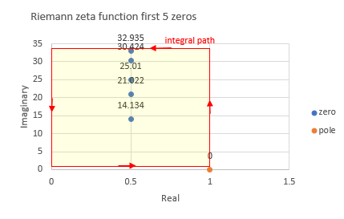
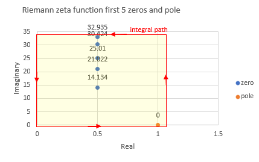
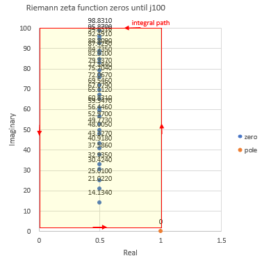

# Riemann zeta function and argument principle

According to argument principle, the number of zeros and poles inside of 
rectangle area of Riemann zeta function is calculated, integral by piecewise quadrature method.  
Due to calculation error occurs, result which means the difference between the number of zeros and poles, 
becomes complex number, almost integer.  
mpmath is used to compute Riemann zeta function and its derivative. 

## usage  
### example 1,  first 5 non-trivial zeros rectangle area  
```
python zeta_zeros.py  
vertical horizontal position [0.1, 33.0] [0.0, 1.0]  
piecewise quadrature step 0.01  
vertical horizontal division number  3290 100  
result (4.99999386888865 + 0.00026736587192154j)  
```
  


### example 2,  improvement calculation error to use smaller piecewise quadrature step. it takes more time. 
``` 
python zeta_zeros.py -d 0.001  
vertical horizontal position [0.1, 33.0] [0.0, 1.0]  
piecewise quadrature step 0.001  
vertical horizontal division number  32900 1000  
result (4.9999999386888 + 2.67364609117596e-6j)  
```


### example 3,  first 5 non-trivial zeros and pole rectangle area. result, reduce one.  
```
python zeta_zeros.py -y 1.1 -a -0.1  
vertical horizontal position [-0.1, 33.0] [0.0, 1.1]  
piecewise quadrature step 0.01  
vertical horizontal division number  3310 110  
result (4.00012873370994 + 5.0342983213897e-6j)  
```
  


### example 4, rectangle area until j100.  result, the number of zeros is 29.  
```
python zeta_zeros.py -b 100  
vertical horizontal position [0.1, 100.0] [0.0, 1.0]  
piecewise quadrature step 0.01  
vertical horizontal division number  9990 100  
result (28.9999988534685 + 0.000267366957181842j)  
```
  


And also, zeta_zeros_colab_notebook.ipynb is a colab notebook.  

## reference link 
[Tables of zeros of the Riemann zeta function](https://www-users.cse.umn.edu/~odlyzko/zeta_tables/)  
